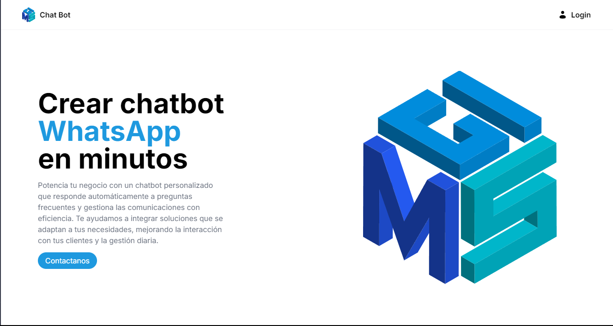
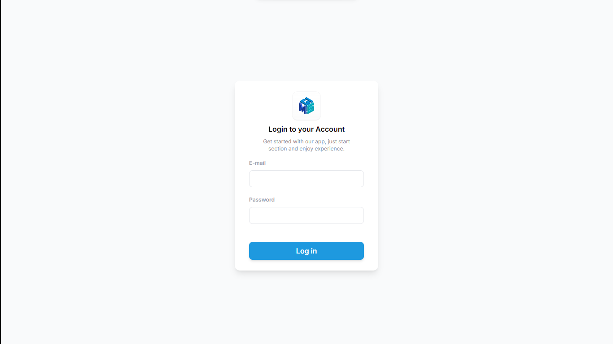
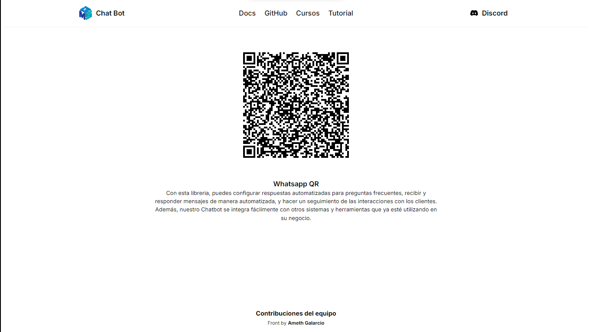

# Custom PortalQR

- [Insgram](https://instagram.com/ameth12_08?igshid=NGExMmI2YTkyZg==) un Follow para apoyar ⭐

- [Portafolio Web 🧑🏽‍💼](https://amethgalarcio.web.app/)
- [GitHub](https://github.com/Ameth1208/) GitHub personal.
- [Qwik Docs 📃](https://qwik.builder.io/)
- [Qwik GitHub](https://github.com/BuilderIO/qwik)
- [@QwikDev](https://twitter.com/QwikDev)
- [Vite ](https://vitejs.dev/)
- [Tailwind ](https://tailwindcss.com/docs/guides/qwik)

---

## 🌐 Web Portal

Personaliza fácilmente tu portal web con estos pasos:

### Cambiar el Logo
Para actualizar el logo en todo el portal, reemplaza el archivo en `src/assets/logo.svg`.

### Personalizar Colores
Modifica los colores primarios y de hover en el archivo `tailwind.config.js`:

```js
colors: {
    primary: "#1e99df",  // Color Primario
    btnHover: "#1d4ed8", // Color de Hover
},
```
---

### 🏠 Home


La ventana del QR está protegida y requiere inicio de sesión. Esto limita el acceso a usuarios autorizados. Puedes cambiar la información de la marca o descripción desde `src/routes/index.tsx`. Para modificar el enlace "Contáctanos", edita `src/data/content.data.tsx`:

```tsx
export const ContentData = {
  // Link Contáctanos
  link: {
    contact: "https://ejemplo.com/",
  },
};
```

Esta estructura proporciona una guía clara y concisa para la personalización de tu portal web.

---

### 🔐 Login



Esta sección describe cómo iniciar sesión en la aplicación. Las credenciales predeterminadas se encuentran en el archivo `login.data.tsx`, ubicado en `src/data/login.data.tsx`. Para modificar las credenciales predeterminadas, edita este archivo:

```tsx
// Tipado y Credenciales por defecto
export interface LoginData {
    email: string,
    password: string,
}

export const credentials: LoginData = {
    email: "admin@admin.com",
    password: "12345678"
}
```

#### Credenciales Predeterminadas para Ingresar

- **Correo o Email:** `admin@admin.com`
- **Contraseña o Password:** `12345678`

---


### 📱 QR 


Esta sección del portal es exclusiva para usuarios que han iniciado sesión. El código QR presentado aquí se actualiza automáticamente utilizando la librería del bot de WhatsApp. Esta funcionalidad asegura que solo los usuarios autenticados puedan acceder y utilizar el código QR, el cual está integrado y sincronizado con el bot de WhatsApp para una funcionalidad específica.

---

### Estructura

La estructura de carpetas del proyecto ha sido modificada para adaptarla a las necesidades del portal personalizado. A continuación se detalla la nueva estructura:

```
└── src/
    ├── components/
    │   └── ...
    └── routes/
        └── ...
```

En la carpeta `src/components/` se encuentran los componentes utilizados para construir la interfaz del portal. Esta carpeta puede ser modificada según las necesidades específicas del proyecto, permitiendo agregar, eliminar o modificar componentes.

En la carpeta `src/routes/` se definen las rutas del portal, es decir, las URL y las correspondientes acciones asociadas a ellas. Aquí también se pueden realizar modificaciones y agregar nuevas rutas según los requisitos del proyecto.

### Desarrollo ✏️

El desarrollo del portal personalizado ha sido creado por Ameth Galarcio, quien aprovechó los módulos ya existentes del proyecto original para construir la versión personalizada. Esto significa que se utilizaron como base los componentes y funcionalidades proporcionados en el proyecto original, pero se realizaron modificaciones y adaptaciones para cumplir con los requisitos específicos del portal personalizado.[Proyecto Original](https://github.com/codigoencasa/bot-whatsapp).

### Build project 🚀

##### Clonar repositorio:

```git
git clone https://github.com/Ameth1208/PortalQR.git
```

##### Instalar dependencias:

```shell
npm i
```

Para compilar el proyecto y generar la versión de producción, se utiliza el comando `npm run bfull.` Este comando genera una carpeta llamada `portalQR`:

```shell
npm run bfull # or `yarn bfull`
```

- `./dist/`: Contiene todos los archivos y recursos necesarios para la visualización del proyecto. Aquí se encuentran los archivos HTML, CSS, JavaScript y otros recursos estáticos.

- `./lib/`: Contiene el archivo `portal.http.csj`, el cual es utilizado por el bot para enviar imágenes al portal. Esta carpeta es importante para la integración del portal con el bot de WhatsApp.

#### Integración con el bot de WhatsApp 🔢

```
packages
    └── portalQR/
       ├── dist/
       │       └── ...
       │  
       ├──lib/
       │     └── ...
       └── packages.json    
```

crea una carpeta dentro del proyecto del bot, llamada `packages` y pega aqui la carpeta **portalQR**, para luego instala el paquete asi.

##### Metodo 1

```shell
npm i file:packages/portalQR
```

Si usas este metodo, tienes que colocar en el codigo del bot

```js
const QRPortalWeb = require("@ameth1208/portal-qr");
```

##### Metodo 2:

o cambia en el package.json del bot la linea donde esta el portal

```shell
  "@bot-whatsapp/portal": "file:src/packages/portalQR",
```

borra los `node_modules`

```shell
  npm i
```

queda igual como lo tienes actualmente

```js
const QRPortalWeb = require("@bot-whatsapp/portal");
```

### QRPortalWeb()

solo se actualizo la interfaz, cada vez que cambies la interfaz tendras que repetir el proceso, pero igual permite una personalizacion completa

```js
const main = async () => {
  const adapterDB = new DataBaseAdapter();
  const adapterFlow = createFlow([flowPrincipal, flowRegister, flowGracias]);
  const adapterProvider = createProvider(WProvider);

  createBot({
    flow: adapterFlow,
    provider: adapterProvider,
    database: adapterDB,
  });

  QRPortalWeb();
};
```

---

<p align="center" 
     >
   
<a href ="https://amethgalarcio.web.app/"></a>

</p>
