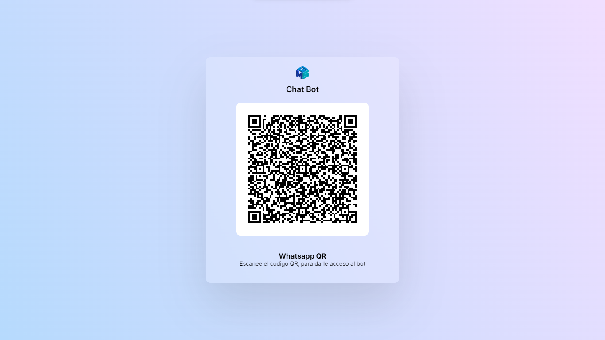

# Custom PortalQR

- [Insgram](https://instagram.com/ameth12_08?igshid=NGExMmI2YTkyZg==) un Follow para apoyar ⭐

- [Portafolio Web 🧑🏽‍💼](https://amethgalarcio.web.app/)

- [GitHub](https://github.com/Ameth1208/) GitHub personal.

- [Qwik Docs 📃](https://qwik.builder.io/)

- [Qwik GitHub](https://github.com/BuilderIO/qwik)

- [@QwikDev](https://twitter.com/QwikDev)

- [Vite ](https://vitejs.dev/)

---

##### Example:



##### Estructura

La estructura de carpetas del proyecto ha sido modificada para adaptarla a las necesidades del portal personalizado. A continuación se detalla la nueva estructura:

```
└── src/
    ├── components/
    │   └── ...
    └── routes/
        └── ...
```

En la carpeta `src/components/` se encuentran los componentes utilizados para construir la interfaz del portal. Esta carpeta puede ser modificada según las necesidades específicas del proyecto, permitiendo agregar, eliminar o modificar componentes.

En la carpeta `src/routes/` se definen las rutas del portal, es decir, las URL y las correspondientes acciones asociadas a ellas. Aquí también se pueden realizar modificaciones y agregar nuevas rutas según los requisitos del proyecto.

##### Desarrollo ✏️

El desarrollo del portal personalizado ha sido creado por Ameth Galarcio, quien aprovechó los módulos ya existentes del proyecto original para construir la versión personalizada. Esto significa que se utilizaron como base los componentes y funcionalidades proporcionados en el proyecto original, pero se realizaron modificaciones y adaptaciones para cumplir con los requisitos específicos del portal personalizado.[Proyecto Original](https://github.com/codigoencasa/bot-whatsapp).

##### Build project 🚀

###### Clonar repositorio:

```git
git clone https://github.com/Ameth1208/PortalQR.git
```

###### Instalar dependencias:

```shell
npm i
```

Para compilar el proyecto y generar la versión de producción, se utiliza el comando `npm run build.full.` Este comando genera una carpeta llamada `portalQR`:

```shell
npm run build.full # or `yarn build.full`
```

- `./dist/`: Contiene todos los archivos y recursos necesarios para la visualización del proyecto. Aquí se encuentran los archivos HTML, CSS, JavaScript y otros recursos estáticos.

- `./lib/`: Contiene el archivo `portal.http.csj`, el cual es utilizado por el bot para enviar imágenes al portal. Esta carpeta es importante para la integración del portal con el bot de WhatsApp.

###### Integración con el bot de WhatsApp 🔢

```
packages
    └── portalQR/
       ├── dist/
       │       └── ...
       │  
       ├──lib/
       │     └── ...
       └── packages.json    
```

crea una carpeta dentro del proyecto del bot, llamada `packages` y pega aqui la carpeta **portalQR**, para luego instala el paquete asi.

###### Metodo 1

```shell
npm i file:packages/portalQR
```

Si usas este metodo, tienes que colocar en el codigo del bot

```js
const QRPortalWeb = require("@ameth1208/portal-qr");
```

###### Metodo 2:

o cambia en el package.json del bot la linea donde esta el portal

```shell
  "@bot-whatsapp/portal": "file:src/packages/portalQR",
```

borra los `node_modules`

```shell
  npm i
```

queda igual como lo tienes actualmente

```js
const QRPortalWeb = require("@bot-whatsapp/portal");
```

###### QRPortalWeb()

solo se actualizo la interfaz, cada vez que cambies la interfaz tendras que repetir el proceso, pero igual permite una personalizacion completa

```js
const main = async () => {
  const adapterDB = new DataBaseAdapter();
  const adapterFlow = createFlow([flowPrincipal, flowRegister, flowGracias]);
  const adapterProvider = createProvider(WProvider);

  createBot({
    flow: adapterFlow,
    provider: adapterProvider,
    database: adapterDB,
  });

  QRPortalWeb();
};
```

---

<p align="center" 
     >
   
<a href ="https://amethgalarcio.web.app/"></a>

</p>
